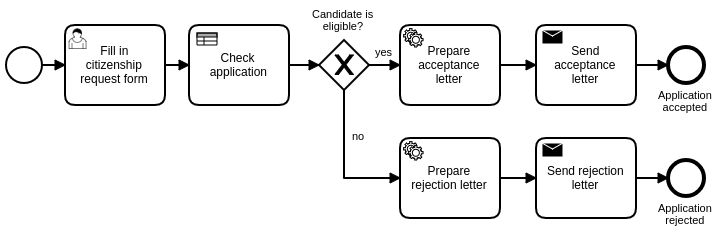

# Camunda BPM Process Application
A Process Application for [Camunda BPM](http://docs.camunda.org).

This project has been generated by the Maven archetype
[camunda-archetype-servlet-war-7.8.0](http://docs.camunda.org/latest/guides/user-guide/#process-applications-maven-project-templates-archetypes).

## Show me the important parts!

## How does it work?
Please make sure you have the following installed.
  * Java JDK (e.g.,[Java 7](http://www.oracle.com/technetwork/java/javase/downloads/jdk7-downloads-1880260.html) or [Java 8](http://www.oracle.com/technetwork/pt/java/javase/downloads/jdk8-downloads-2133151.html))
  * Camunda Tomcat, JBOSS or WildFly distribution: [Camunda](http://camunda.org/download)
  * Download and install [Eclipse](http://www.eclipse.org/downloads)
  * Install [Camunda BPMN Modeler](https://camunda.org/download/modeler)

## How to use it?
Please check instructions from the course 1008 in the [Learn@WU](https://learn.wu.ac.at) platform.

Once you deployed the application you can run it using
[Camunda Tasklist](http://docs.camunda.org/latest/guides/user-guide/#tasklist)
and inspect it using
[Camunda Cockpit](http://docs.camunda.org/latest/guides/user-guide/#cockpit).

## Environment Restrictions
Built and tested against Camunda BPM version 7.8.0.

## Known Limitations

## Improvements Backlog

## License
[Apache License, Version 2.0](http://www.apache.org/licenses/LICENSE-2.0).

<!-- HTML snippet for index page
  <tr>
    <td></td>
    <td><a href="snippets/citizenship">Camunda BPM Process Application</a></td>
    <td>A Process Application for [Camunda BPM](http://docs.camunda.org).</td>
  </tr>
-->
<!-- Tweet
New @CamundaBPM example: Camunda BPM Process Application - A Process Application for [Camunda BPM](http://docs.camunda.org). https://github.com/camunda/camunda-consulting/tree/master/snippets/citizenship
-->
